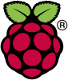
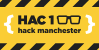

# Hack Manchester Junior Raspberry Pi challenge

Raspberry Pi Sense HAT challenge for Hack Manchester Junior 2015

  

## Background

[Raspberry Pi](https://www.raspberrypi.org/) is a tiny bare bones computer designed to inspire people of all ages to learn to code and build things. We want to see these people become creative technologists.

In December, British ESA astronaut [Tim Peake](https://twitter.com/astro_timpeake) is going to the [International Space Station](https://en.wikipedia.org/wiki/International_Space_Station) for 6 months - and as part of his [mission](http://principia.org.uk/) he's taking two Raspberry Pis with attached sensor boards in a special enclosure made of space grade aluminium - the Pis will be running science experiments coded by kids from UK schools. The sensor board is called the Sense HAT and we've provided these for you to hack on.

The Sense HAT has an 8x8 full colour LED display, a mini joystick and a bunch of sensors including:

- Temperature
- Humidity
- Pressure
- Accelerometer
- Gyroscope
- Magnetometer

There's a [Python library](https://pythonhosted.org/sense-hat/) providing easy access to the sensors and the LED display.

## The challenge

Conduct a science experiment using the Raspberry Pi and Sense HAT utilising one or more of its sensors. The experiment should be used as a tool to demonstrate and teach a concept like gravity - ideally something that can be reproduced in space and would show different results.

## Tips

- The joystick can be used to take manual input from a person (e.g. make a game or interactive exhibit).
- The LED display can be used to display text or data. Think about how to visualise sensor data on the screen.
- The accelerometer can be used to trigger an action (e.g. shake to continue)
- The gyroscope can be used to identify which direction (pitch, roll and yaw) the device is tilted
- The magnetometer can be used to determine which way the device is pointing (like a compass)
- The humidity sensor value increases with a presence of water in the air (try sticking it in a sandwich bag and breathing into it with a straw)
- The pressure sensor value increases when air is compressed (try sticking it in a sandwich bag, sealing it and pushing down to compress the air)

## Helpful resources and example code

- [Sense HAT Python documentation](https://pythonhosted.org/sense-hat/)
- [Exploring the Raspberry Pi Sense HAT](https://opensource.com/life/15/10/exploring-raspberry-pi-sense-hat#comment-84021)
- [Getting Started with the Sense HAT, Astro Pi Guide and more on the Raspberry Pi Learning Resources](https://www.raspberrypi.org/resources/)
- [Dave Honess's Sense HAT Examples](https://github.com/RPi-Distro/python-sense-hat/tree/master/examples)
- [Ben Nuttall's Sense HAT examples](https://github.com/bennuttall/sense-hat-examples)
- [Martin O'Hanlon's Sense HAT examples](http://www.stuffaboutcode.com/2015/05/astro-pi-getting-started.html)
- [Richard Hayler's PyGame application for creating 8x8 images](https://github.com/topshed/RPi_8x8GridDraw)

## The prizes

Each member of the team will win an Astro Pi kit containing:

- 1 x [Raspberry Pi 2 Model B](https://www.raspberrypi.org/products/raspberry-pi-2-model-b/)
- 1 x [Sense HAT attachment board](https://www.raspberrypi.org/products/sense-hat/)
- and more

This means you can continue your great work at home, set up more experiments, learn more and create things.
